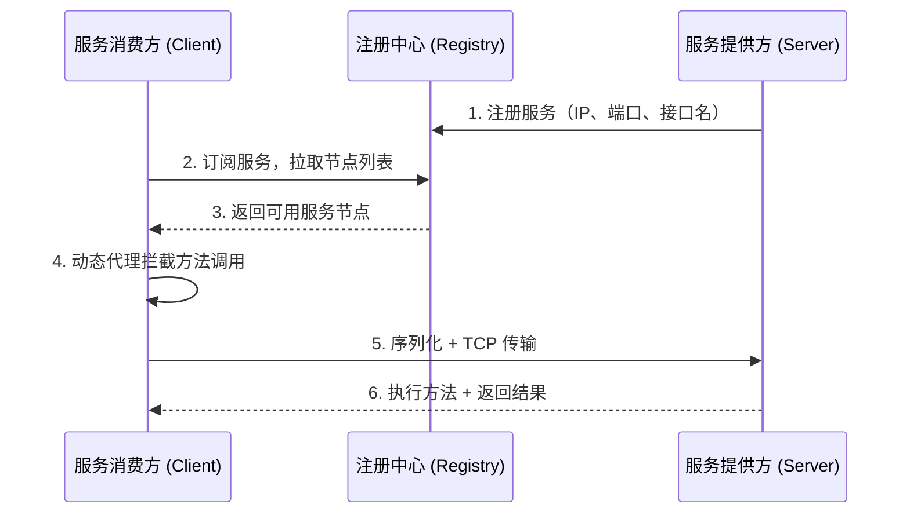

<div align="center">

# 🔧 Java-RPCFrame


**从零实现的轻量级 RPC 框架（学习向）**
<br>
手写网络通信 | 自定义二进制协议 | 动态代理调用

</div>

---

## 💡 项目简介

这是一个用于深入理解 RPC 原理的自研框架，目标是**不依赖现成 RPC 框架**，从 TCP 连接建立到方法调用拦截，逐层手动实现。

动手之前我以为 RPC 就是"封装一下网络请求"，做完才意识到光是解决 TCP 粘包问题就要设计整套协议头，序列化和反序列化的类型对齐也踩了不少坑。

---

## ✅ 当前已实现

### 1. 基于 Socket/TCP 的网络通信层
- 手动管理 Socket 连接的建立与关闭
- 自定义二进制协议头，字段如下：

| 字段 | 长度 | 说明 |
|------|------|------|
| Magic Number | 4 byte | 协议标识，防止非法数据包 |
| Version | 1 byte | 协议版本 |
| Message Type | 1 byte | 请求 / 响应 / 心跳 |
| Request ID | 8 byte | 请求唯一标识 |
| Data Length | 4 byte | 消息体长度，解决粘包问题 |

### 2. 基于动态代理的 RPC 调用拦截
- 使用 JDK 动态代理，对消费端屏蔽网络通信细节
- `@RpcReference` 注解注入代理对象，调用方无感知

**消费端示例：**
```java
@RpcReference(version = "1.0")
private HelloService helloService;

// 调用方式与本地方法完全一致
helloService.sayHello("World");
```

**提供端示例：**
```java
@RpcService(interfaceClass = HelloService.class)
public class HelloServiceImpl implements HelloService {
    @Override
    public String sayHello(String name) {
        return "Hello, " + name + "!";
    }
}
```

---

## 🗺️ 进行中 / 计划中

- [ ] 接入 Netty 替换原生 Socket（解决阻塞 I/O 的性能瓶颈）
- [ ] 集成 Redis / Zookeeper 实现动态服务注册与发现
- [ ] 心跳检测与断线重连
- [ ] 负载均衡策略（轮询、随机、一致性哈希）

---

## 🏗️ 整体架构


> 注：注册中心部分目前尚未实现，架构图为设计目标。

---

## 🛠️ 技术栈

| 技术 | 用途 |
|------|------|
| Java 11 | 核心语言 |
| Java Socket | 网络通信（Netty 重构中） |
| JDK 动态代理 | RPC 调用拦截 |
| Spring Boot | IoC 容器 + 注解支持 |
| Lombok / SLF4J | 工具链 |

---

## 🚀 快速开始

### 环境准备
- JDK 11+
- Maven 3.6+

### 启动方式
```bash
# 克隆项目
git clone https://github.com/yourname/java-rpcframe.git

# 启动服务提供方
mvn spring-boot:run -pl rpc-provider

# 启动服务消费方
mvn spring-boot:run -pl rpc-consumer
```

---

## 📄 许可证
本项目采用 [Apache 2.0](LICENSE) 许可证。
